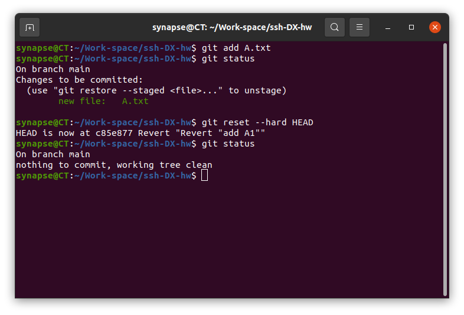
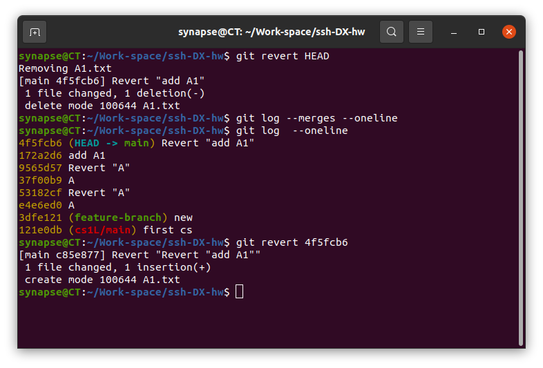
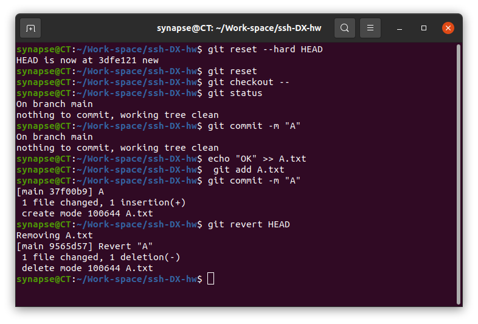
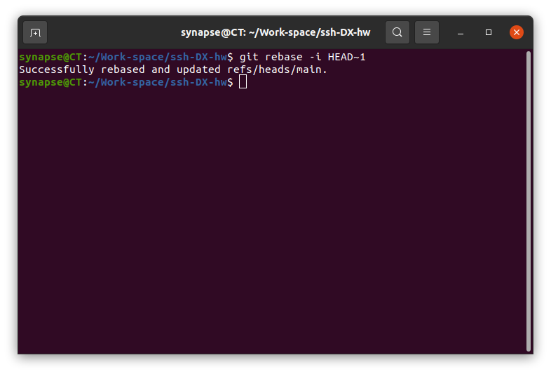
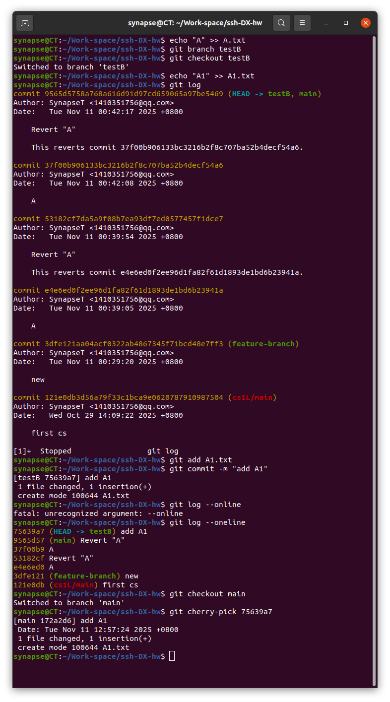
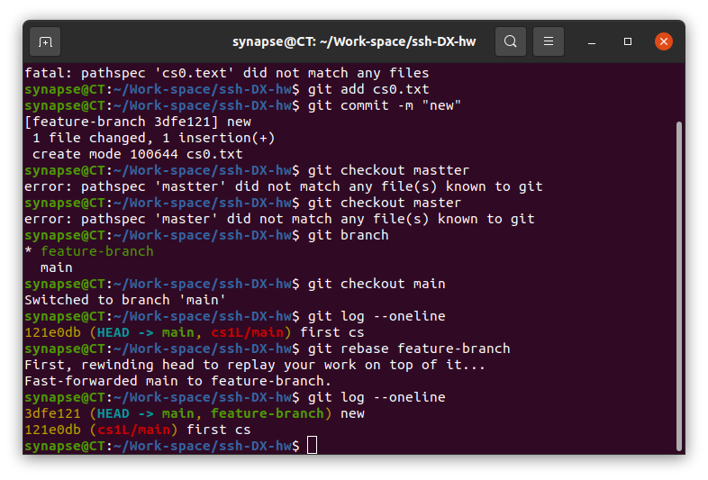

# 二：

1. ：
   
   ```
   git reset HEA后git checkout -- .
   ```
   
   ***或者***
   
   ```
   git reset --hard HEAD
   ```




---

2. ：

```
不修改历史的方式：git reset HEAD
  git reset <commit-hash>
修改历史的方式：git rebase -i HEAD~1
  git reset --hard HEAD
```





---

3. ：
   
   ```
   git checkout main
   git cherry-pick <commit-hash>
   ```
   
   ***或者***
   
   ```
   git checkout feature-branch
   git checkout main
   git rebase feature-branch
   ```
   
   
   
