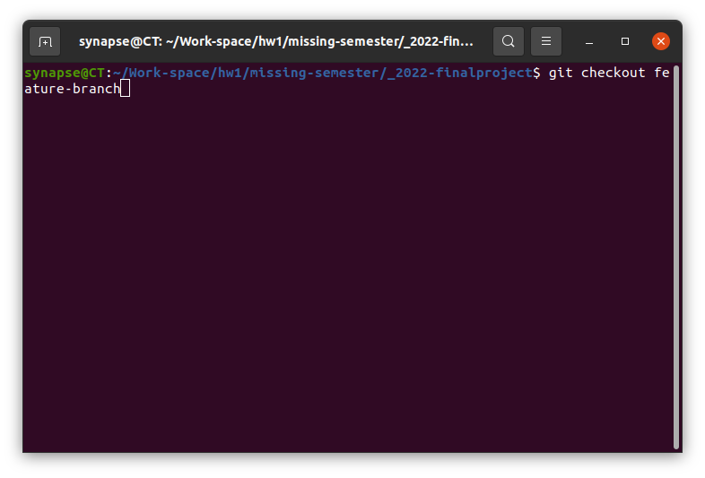

# 二：

1. ：
   
   ```
   git reset HEA后git checkout -- .
   ```
   
   ***或者***
   
   ```
   git stash push --include-untracked
   ```


---

2. ：

```
不修改历史的方式：git reset --soft HEAD~1
修改历史的方式：git reset --soft HEAD~1
```


---

3. ：
   
   ```
   git checkout main
   git cherry-pick <commit-hash1> <commit-hash2>
   git cherry-pick <start-commit>..<end-commit>
   ```
   
   ***或者***
   
   ```
      git checkout feature-branch
   git format-patch main --stdout > feature.patch
   git checkout main
   git apply feature.patch
   ```
   
   
